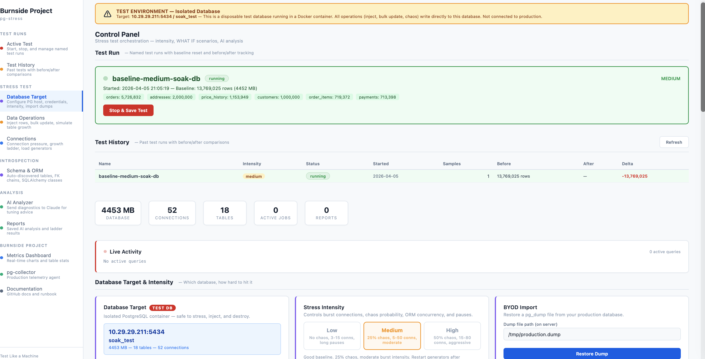
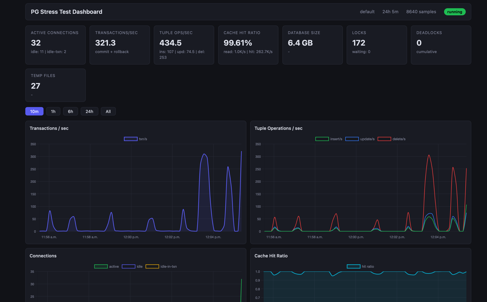

<!-- Logo placeholder -->
<p align="center">
  <strong>pg-stress</strong>
</p>

<p align="center">
  Point at any PostgreSQL &rarr; auto-discover schema &rarr; stress test &rarr; Claude-powered advisory.
</p>

<p align="center">
  <a href="LICENSE"></a>
  <a href="https://github.com/dataalgebra-engineering/pg-stress"></a>
  <a href="https://claude.ai"></a>
</p>

## What is pg-stress?

A one-off or continous stress testing platform for **any PostgreSQL database**. **Completely safe in a test platform using your own data** No models to write.
No queries to define. No schema to configure. Point it at your database — pg-stress
introspects the schema, discovers relationships, classifies tables, and generates
realistic ORM and SQL load patterns automatically.

After the test, feed the results to Claude for tuning advice, query fixes, and
capacity predictions.

## What you can do beyond one off test
Before releasing a new query in the **WILD - inject that query in pg-stress. Run it with 100s of connection, test the joints, insert 10M rows(kidding !). Output the findings to Claude Chat box for advisory!

## How It Works

```
YOUR DATABASE (any schema, any size)
     │
     ▼
INTROSPECT ─── tables, FKs, indexes, row counts, types
     │          classify: entity | transactional | append_only | lookup | hierarchical
     │          build FK chains: [customers → orders → order_items]
     ▼
REFLECT ────── SQLAlchemy automap: ORM classes generated for every table
     │          relationships auto-detected from FK constraints
     ▼
STRESS ─────── 10 ORM patterns applied to discovered schema
     │          N+1, eager load, bulk insert, pagination, aggregation, EXISTS
     │          + raw SQL generator + pgbench + chaos injection
     ▼
CAPTURE ────── pg_stat_statements, table stats, cache ratio, locks, wait events
     │          before/after deltas, anomaly detection
     ▼
ADVISE ─────── Claude analyzes diagnostics → tuning, query fixes, capacity predictions
```

---

> ### Control Panel — configure intensity, inject rows, run growth ladders, trigger AI analysis
> 

---

> ### Metrics Dashboard — real-time TPS, cache ratio, connections, table sizes
> 

---

## Quickstart

### I have production data:

```console
$ mkdir pg-stress
$ cd pg-stress
$ git clone https://github.com/burnside-project/pg-stress.git
$ cd pg-stress && cp .env.example .env
$ make import DUMP=/path/to/production.dump
$ make up INTENSITY=medium
```

### I don't have production data:

```console
$ git clone https://github.com/burnside-project/pg-stress.git
$ cd pg-stress
$ make up                        # Seeds 18-table e-commerce schema (~30M rows)
```

Open `http://localhost:3100` — pg-stress auto-discovers your schema and starts generating load.

## What Happens at Startup

pg-stress connects to PostgreSQL and introspects the schema automatically:

```
2026-04-01 10:00:01 INFO Introspecting database: production_db
2026-04-01 10:00:01 INFO Found 42 tables
2026-04-01 10:00:02 INFO Classification: entity=8 transactional=12 append_only=6 lookup=14 hierarchical=2
2026-04-01 10:00:02 INFO Schema: 42 tables, 38 relationships, 24 FK chains
2026-04-01 10:00:02 INFO Queryable: 30 tables, insertable: 18, updatable: 20, paginable: 26
2026-04-01 10:00:02 INFO 5 workers running against 42 tables
```

No configuration. No model definitions. Works with 5 tables or 500.

## Three Knobs

### 1. Database Target (`.env`)

```
PG_USER=myuser
PG_PASSWORD=mypass
PG_DATABASE=mydb
```

### 2. Intensity (CLI or UI)

```bash
make up INTENSITY=low              # No chaos, 3-15 conns, safe for BYOD validation
make up INTENSITY=medium           # 25% chaos, 5-50 conns (default)
make up INTENSITY=high             # 50% chaos, 15-80 conns, finds breaking points
```

### 3. WHAT IF Scenarios (UI or API)

| Action | What it tests |
|--------|---------------|
| Inject 10M rows | "What if this table doubles?" |
| Bulk update 20M rows | "What if we archive old data?" |
| 100 connections | "What happens at peak traffic?" |
| Growth ladder 10→200 | "At what point does it break?" |

## Schema Introspection

pg-stress discovers your schema and classifies every table:

| Signal | Classification | Load Pattern |
|---|---|---|
| Has FK children + timestamps | **entity** | N+1, eager load, EXISTS filter |
| Has status + updated_at | **transactional** | CRUD, status transitions |
| Only created_at, no updates | **append_only** | Bulk insert, time-range queries |
| Small, no FK children | **lookup** | Read-only via JOINs |
| Self-referencing FK | **hierarchical** | Tree traversal |

FK chains are discovered automatically and drive query patterns:

```
customers → orders → order_items → product_variants
                  → payments
                  → shipments
products → variants → inventory
```

## 10 Auto-Generated ORM Patterns

Each pattern is a generic template applied to **your** FK chains — not hardcoded queries:

| Pattern | What it generates |
|---------|-------------------|
| **N+1 selects** | Load parent, lazy-load each child (any FK chain) |
| **Eager joinedload** | Single SELECT with LEFT OUTER JOINs (any relationship) |
| **Eager subqueryload** | Base SELECT + IN (subquery) for children |
| **Eager selectinload** | Base SELECT + IN ($1,...,$N) literal list |
| **Bulk INSERT** | Clone rows from any append-only table |
| **ORM update** | Load-modify-save on any table with timestamps |
| **Pagination** | LIMIT/OFFSET on any table with ordering columns |
| **Aggregation** | count/sum/avg on any numeric column grouped by FK |
| **EXISTS filter** | EXISTS subquery on any parent-child relationship |
| **Relationship JOIN** | ORM-generated JOINs via any FK path |

## Services

| Service | Port | Description |
|---------|------|-------------|
| PostgreSQL 15 | 5434 | Database under test |
| Raw SQL Generator (Go) | 9090 | 25+ hand-written OLTP operations, 6 chaos patterns |
| ORM Generator (Python) | 9091 | 10 auto-discovered ORM patterns via schema introspection |
| Dashboard | 8000 | Real-time charts: TPS, cache ratio, connections, table sizes |
| Control Plane API | 8100 | REST API for WHAT IF scenarios, generator control, AI analysis |
| Control Panel UI | 3100 | Browser-based dashboard with intensity controls |

## AI Analyzer

After a stress test, send diagnostics to Claude:

```bash
export ANTHROPIC_API_KEY=sk-ant-...
make analyze                       # Full report
make analyze-tuning                # PostgreSQL parameter tuning
make analyze-queries               # Query optimization + N+1 detection
make analyze-capacity              # Growth projections + capacity limits
```

Collects 11 diagnostic datasets from PostgreSQL: top queries, cache misses, temp spills,
N+1 candidates, database stats, table stats, index stats, unused indexes, connections,
locks, wait events, and current PG settings.

## Commands

| Command | What it does |
|---------|-------------|
| `make up` | Start core stack |
| `make up INTENSITY=high` | Start with high intensity |
| `make import DUMP=file` | BYOD: restore pg_dump |
| `make up-orm` | Add ORM load generator |
| `make up-full` | Start everything |
| `make down` | Stop and remove volumes |
| `make pg-stat` | Top 20 queries by execution time |
| `make db-size` | Database and table sizes |
| `make analyze` | Claude AI analysis (full) |
| `make analyze-tuning` | AI focused on PG tuning |
| `make healthz` | Check all services |
| `make report` | Collect comprehensive report |
| `make clean` | Stop, remove volumes and output |

## Documentation

| Doc | Description |
|-----|-------------|
| [How It Works](docs/01-how-it-works.md) | Introspect → reflect → generate load pipeline |
| [Quickstart](docs/02-quickstart.md) | BYOD and seed paths, verification steps |
| [Schema Introspection](docs/03-introspection.md) | What gets discovered, table classification, FK chains |
| [Control Plane](docs/04-control-plane.md) | API endpoints, intensity presets, WHAT IF operations |
| [Configuration](docs/05-configuration.md) | All environment variables |

## pg-stress vs pg-collector

| | pg-stress | pg-collector |
|---|---|---|
| **When** | One-off, before a change or event | Always running |
| **Where** | Disposable test server | Production |
| **Input** | Any PostgreSQL (auto-discovered) | Live production queries |
| **Purpose** | "What will happen?" | "What is happening?" |
| **Output** | LLM advisory report | Metric time-series |

## Relationship to Burnside Project

| Project | Role |
|---------|------|
| [pg-collector](https://github.com/burnside-project/pg-collector) | Ongoing production telemetry |
| [pg-warehouse](https://github.com/burnside-project/pg-warehouse) | Local-first analytical warehouse (PostgreSQL &rarr; DuckDB) |
| **pg-stress** | One-off stress test &rarr; LLM advisory |

## License

[Apache License 2.0](LICENSE) -- Copyright 2025-2026 [Burnside Project](https://burnsideproject.ai)
