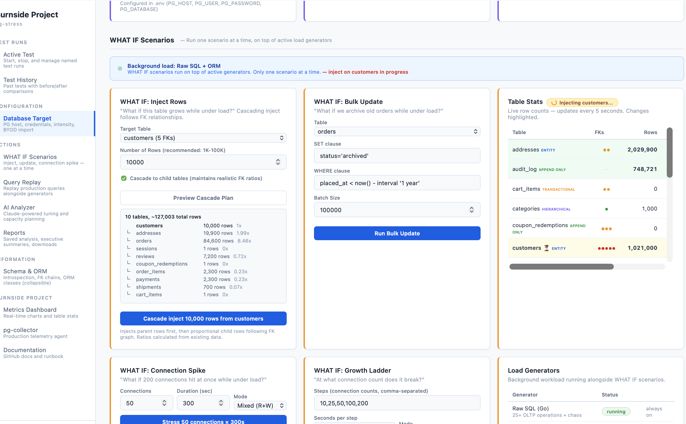
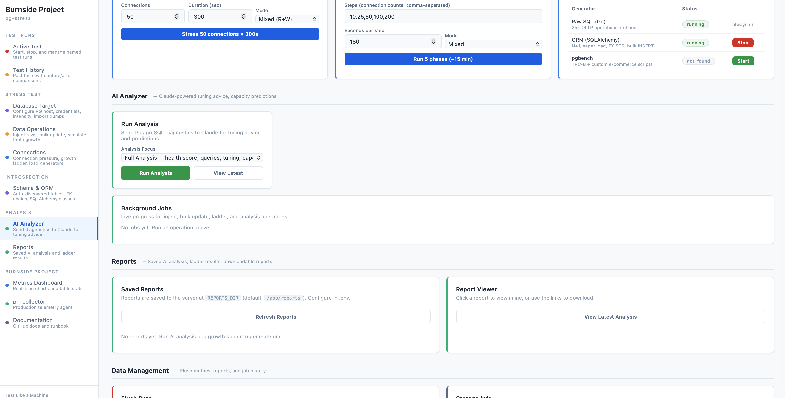
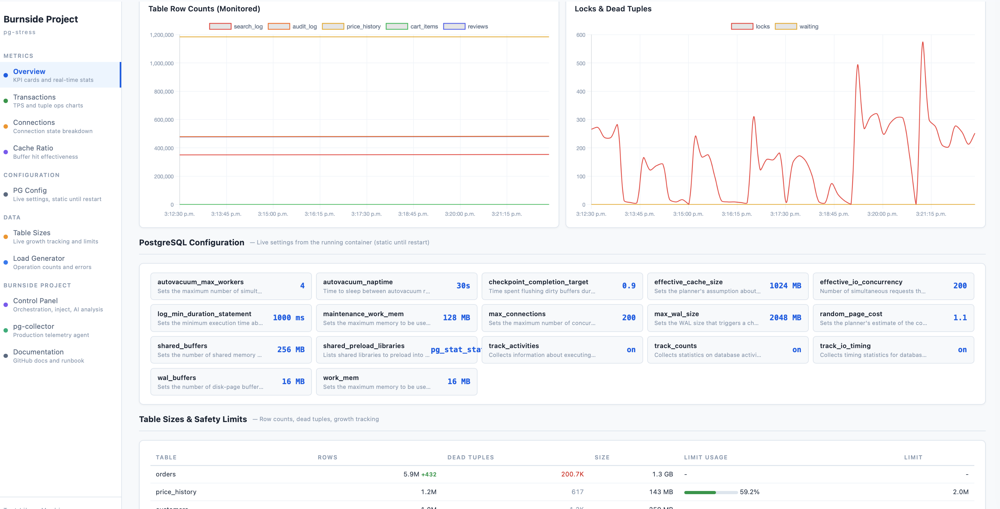

<!-- Logo placeholder -->
<p align="center">
  <strong>pg-stress</strong>
</p>

<p align="center">
  Point at any PostgreSQL &rarr; auto-discover schema &rarr; stress test &rarr; Claude-powered advisory.
</p>

<p align="center">
  <a href="https://github.com/burnside-project/pg-stress/actions/workflows/ci-cd.yml"></a>
  <a href="https://github.com/burnside-project/pg-stress/releases/latest"></a>
  <a href="LICENSE"></a>
  <a href="https://claude.ai"></a>
</p>

## What is pg-stress?

A **100% local, one-off** stress testing platform for any PostgreSQL database.
No models to write. No queries to define. No schema to configure. No data leaves
your machine.

Point it at your database — pg-stress introspects the schema, discovers relationships,
classifies tables, and generates realistic ORM and SQL load patterns automatically.
After the test, Claude analyzes the diagnostics and gives tuning advice.

### Core Features

| Feature | Description |
|---------|-------------|
| **Named Test Runs** | Start, stop, and compare tests. Every test resets to a known baseline (production dump). Before/after snapshots saved to SQLite. |
| **Schema Graph (NetworkX)** | Introspects tables, FKs, indexes on startup. Builds a directed graph cached in SQLite — instant load on restart, no repeated introspection. Scales to 5,000+ tables. |
| **Cascading Inject** | Inject rows into a parent table and automatically inject proportional child rows following the FK graph. Ratios calculated from existing data. Works with any schema — ecommerce, CRM, healthcare. |
| **WHAT IF Scenarios** | One scenario at a time, on top of active load generators: inject rows (with cascade), bulk update, connection spike, growth ladder. Live table stats with row deltas and spinning progress indicator. |
| **Production Query Replay** | Import real queries from `pg_stat_statements` or SQL files. Replay at configurable concurrency alongside generators. Per-query timing (avg/min/max ms, errors). |
| **Live Activity Ticker** | Real queries from `pg_stat_activity` updated every 2s, color-coded by type (SELECT, INSERT, JOIN, EXISTS), with table names and durations. On both portals. |
| **10 ORM Patterns** | N+1, eager load (join/subquery/selectin), bulk insert, pagination, aggregation, EXISTS filter, relationship JOIN — applied to YOUR schema via SQLAlchemy automap. |
| **AI Analyzer** | Claude reads 11 PostgreSQL diagnostic datasets. Returns tuning advice, query fixes, N+1 detection, capacity predictions. Executive summary compares across test runs. |
| **3-Day Capacity Planning** | Day 1: baseline. Day 2: 2x growth. Day 3: with fixes. Day 4: compare all 3 reports. Hand off to pg-deploy for right-sized infrastructure. |
| **DuckDB Analytics** | Fast time-series aggregations on SQLite metrics. Avg/peak TPS, cache ratio, growth rate — computed on demand, no import step. |
| **PostgreSQL Config Viewer** | Live PG settings displayed on the dashboard — shared_buffers, work_mem, max_connections, etc. Deliberately modest defaults so AI Analyzer can recommend improvements. |
| **Dual Portal UI** | Control Panel (`:3100`) for orchestration + Metrics Dashboard (`:8200`) for real-time charts. Cross-linked sidebars. Light mode matching Burnside Project style. |
| **Fully Local** | SQLite for metrics, DuckDB for analytics, NetworkX for schema graph, PostgreSQL for stress target. Nothing leaves your network. |
| **Managed PostgreSQL Support** | Load production data into a private managed PostgreSQL instance, deploy pg-stress on a test host in the same VPC/VNet. No public internet exposure. |

### pg-stress vs pg-collector

| | pg-stress | pg-collector |
|---|---|---|
| **When** | One-off, before a change or event | Always running |
| **Where** | Disposable test server (Docker) | Production |
| **Data** | 100% local (SQLite + DuckDB) | Shipped to warehouse |
| **Purpose** | "What will happen?" | "What is happening?" |
| **Output** | AI advisory report | Metric time-series |
| **Duration** | Minutes to hours | Ongoing |

## How It Works

```
YOUR DATABASE (any schema, any size)
     │
     ▼
INTROSPECT ─── tables, FKs, indexes, row counts, types
     │          classify: entity | transactional | append_only | lookup | hierarchical
     │          NetworkX directed graph cached in SQLite (instant on restart)
     ▼
REFLECT ────── SQLAlchemy automap: ORM classes generated for every table
     │          relationships auto-detected from FK constraints
     ▼
STRESS ─────── 10 ORM patterns + raw SQL + production query replay
     │          cascading inject follows FK graph with proportional ratios
     │          WHAT IF scenarios on top of active generators
     ▼
CAPTURE ────── pg_stat_statements, table stats, cache ratio, locks, wait events
     │          SQLite metrics (persistent), DuckDB analytics (on demand)
     │          per-query replay timing, before/after snapshots per test run
     ▼
ADVISE ─────── Claude analyzes diagnostics → tuning, query fixes, capacity predictions
     │          executive summary across multiple test runs
     │          deployment readiness report → hand off to pg-deploy
```

> ### Control Panel (`:3100`) — Test runs, live activity, WHAT IF scenarios, AI analysis
> 

---

> ### Control Panel (`:3100`) — What if senerio stress
> 
>
> `http://<host>:3100` — Start/stop named tests, inject rows, run growth ladders,
> Introspects tables, FKs, indexes on startup. Builds a directed graph cached
> Inject rows into a parent table and automatically inject proportional child rows 
  following the FK graph. Ratios calculated from existing data. Works with any schema
  ecommerce, CRM, healthcare

---

> ### Metrics Dashboard (`:8200`) — Real-time charts, table growth, live queries
> 
>
> `http://<host>:8200` — TPS, cache hit ratio, connections, table sizes with live
> growth deltas (+N/-N), locks, dead tuples. Live activity ticker shows every query
> running right now. Test run badge shows active test name and baseline.

---

> ### Metrics Dashboard (`:8200`) — Get AI enabeled tuning advise
> 
>
> `http://<host>:8200` —  After the test, Claude analyzes the diagnostics and gives tuning advice.
> 
> You need Claude AI API Key 

---

> ### Metrics Dashboard (`:8200`) — View Real-time Postgresql Config
> 
>
> `http://<host>:8200` — View realtime Postgresql Config Parameters
> 
> No need to dig into your config file. Refine your config prams and restart TEST server to shadow your Production Server Configs!

## Install

Every push to `main` builds multi-arch Docker images (`linux/amd64` + `linux/arm64`)
and publishes them to GHCR with an auto-incremented release candidate tag.

```bash
# Pull latest RC images
for svc in load-generator load-generator-orm pgbench-runner dashboard truth-service; do
  docker pull ghcr.io/burnside-project/pg-stress/${svc}:rc-latest
done
```

Or pin to a specific version:

```bash
docker pull ghcr.io/burnside-project/pg-stress/load-generator:v1.0.0-rc16
```

See [Releases](https://github.com/burnside-project/pg-stress/releases) for all versions and changelogs.

## Quickstart

### Path A: I have production data

> pg-stress runs its own PostgreSQL container — it does **not** connect to your
> live production database. Instead, you export a dump and import it locally.

**Step 1 — Export a dump from production** (run against your production DB):

```bash
pg_dump -Fc -h prod-host -U prod_user my_production_db > production.dump
```

**Step 2 — Clone and configure:**

```console
$ git clone https://github.com/burnside-project/pg-stress.git
$ cd pg-stress && cp .env.example .env
```

Edit `.env`:

```bash
PG_DATABASE=my_production_db       # must match the DB name in your dump
SEED_SCHEMA=false                  # skip built-in e-commerce schema
```

**Step 3 — Import and start:**

```console
$ make import DUMP=production.dump
$ make up INTENSITY=medium
```

pg-stress restores your dump into the local container, introspects your schema,
and starts generating load automatically.

### Path B: I don't have production data

```console
$ git clone https://github.com/burnside-project/pg-stress.git
$ cd pg-stress
$ make up                        # Seeds 18-table e-commerce schema (~30M rows)
```

Open `http://localhost:3100` — pg-stress auto-discovers your schema and starts generating load.

## What Happens at Startup

pg-stress connects to PostgreSQL and introspects the schema automatically:

```
2026-04-01 10:00:01 INFO Introspecting database: production_db
2026-04-01 10:00:01 INFO Found 42 tables
2026-04-01 10:00:02 INFO Classification: entity=8 transactional=12 append_only=6 lookup=14 hierarchical=2
2026-04-01 10:00:02 INFO Schema: 42 tables, 38 relationships, 24 FK chains
2026-04-01 10:00:02 INFO Queryable: 30 tables, insertable: 18, updatable: 20, paginable: 26
2026-04-01 10:00:02 INFO 5 workers running against 42 tables
```

No configuration. No model definitions. Works with 5 tables or 500.

## Monitoring the Stress Test

Once the stack is running, there are several ways to see what's happening.

### Control Panel UI (`:3100`)

The primary interface. Shows database target, current intensity, service status,
connections, table counts, and active jobs. From here you can:

- Switch intensity (Low / Medium / High)
- Import a production dump (BYOD)
- Inject rows into any table
- Run bulk updates
- Launch connection pressure tests
- Start growth ladders
- Trigger AI analysis

### Metrics Dashboard (`:8200`)

Real-time auto-refreshing charts and live activity feed:

- **Live Activity Ticker** — real queries from `pg_stat_activity`, updated every 2s,
  color-coded by type (SELECT, INSERT, JOIN, EXISTS, AGGREGATION), with duration and table name
- **TPS** — transactions per second over time
- **Cache hit ratio** — shared buffer effectiveness
- **Active connections** — current vs max
- **Table sizes** — growth over time
- **Dead tuples** — autovacuum pressure

### ORM Generator Health (`:9091/healthz`)

Shows per-pattern operation counts in real time:

```json
{
  "status": "running",
  "uptime_s": 725,
  "ops": {
    "n_plus_1": 9739,
    "eager_join": 9833,
    "eager_subquery": 6429,
    "eager_selectin": 6473,
    "bulk_insert": 3243,
    "orm_update": 6389,
    "pagination": 6444,
    "aggregation": 6701,
    "exists_filter": 6580,
    "relationship": 3227,
    "errors": 0
  }
}
```

### Control Plane API (`:8100`)

REST API with Swagger docs at `/docs`. Key endpoints for monitoring:

```bash
# Stack status — services, DB size, connections, table row counts
curl http://<host>:8100/status

# Current config — database target + intensity level
curl http://<host>:8100/config

# Background job status
curl http://<host>:8100/jobs
```

### PostgreSQL Direct Queries

Connect to the database and inspect what the stress test is doing:

```bash
# Top queries by total execution time
make pg-stat

# Database and table sizes
make db-size

# Or connect directly
docker compose exec postgres psql -U postgres -d <your_db>
```

Example — top queries during a stress test against `soak_test`:

```
 calls | total_ms | mean_ms | query
-------+----------+---------+----------------------------------------------------
  6792 |  2225923 |  327.73 | SELECT p.id, p.name, similarity(p.name, $1) AS ...
   471 |  1308156 | 2777.40 | SELECT orders.id, orders.customer_id, orders.... (N+1)
   532 |   484258 |  910.26 | SELECT date_trunc($1, placed_at) AS hour, count(*)...
   454 |   172025 |  378.91 | SELECT public.order_items.id, ... (eager join)
   557 |   146450 |  262.93 | SELECT p.id, count(oi.id) AS units_sold, sum(...)
```

This tells you exactly which queries are consuming the most time — the same
queries Claude analyzes when you run `make analyze`.

## Three Knobs

### 1. Database Target (`.env`)

These configure the **local Docker container**, not a remote server:

```bash
PG_USER=postgres               # container Postgres user (default: postgres)
PG_PASSWORD=postgres           # container Postgres password (default: postgres)
PG_DATABASE=mydb               # database name — match your dump for Path A
SEED_SCHEMA=false              # false when using your own imported dump
```

### 2. Intensity (CLI or UI)

```bash
make up INTENSITY=low              # No chaos, 3-15 conns, safe for BYOD validation
make up INTENSITY=medium           # 25% chaos, 5-50 conns (default)
make up INTENSITY=high             # 50% chaos, 15-80 conns, finds breaking points
```

### 3. WHAT IF Scenarios (UI or API)

| Action | What it tests |
|--------|---------------|
| Inject 10M rows | "What if this table doubles?" |
| Bulk update 20M rows | "What if we archive old data?" |
| 100 connections | "What happens at peak traffic?" |
| Growth ladder 10→200 | "At what point does it break?" |

## Schema Introspection

pg-stress discovers your schema and classifies every table:

| Signal | Classification | Load Pattern |
|---|---|---|
| Has FK children + timestamps | **entity** | N+1, eager load, EXISTS filter |
| Has status + updated_at | **transactional** | CRUD, status transitions |
| Only created_at, no updates | **append_only** | Bulk insert, time-range queries |
| Small, no FK children | **lookup** | Read-only via JOINs |
| Self-referencing FK | **hierarchical** | Tree traversal |

FK chains are discovered automatically and drive query patterns:

```
customers → orders → order_items → product_variants
                  → payments
                  → shipments
products → variants → inventory
```

## 10 Auto-Generated ORM Patterns

Each pattern is a generic template applied to **your** FK chains — not hardcoded queries:

| Pattern | What it generates |
|---------|-------------------|
| **N+1 selects** | Load parent, lazy-load each child (any FK chain) |
| **Eager joinedload** | Single SELECT with LEFT OUTER JOINs (any relationship) |
| **Eager subqueryload** | Base SELECT + IN (subquery) for children |
| **Eager selectinload** | Base SELECT + IN ($1,...,$N) literal list |
| **Bulk INSERT** | Clone rows from any append-only table |
| **ORM update** | Load-modify-save on any table with timestamps |
| **Pagination** | LIMIT/OFFSET on any table with ordering columns |
| **Aggregation** | count/sum/avg on any numeric column grouped by FK |
| **EXISTS filter** | EXISTS subquery on any parent-child relationship |
| **Relationship JOIN** | ORM-generated JOINs via any FK path |

## Services

| Service | Port | Description |
|---------|------|-------------|
| PostgreSQL 15 | 5434 | Database under test |
| Raw SQL Generator (Go) | 9090 | 25+ hand-written OLTP operations, 6 chaos patterns |
| ORM Generator (Python) | 9091 | 10 auto-discovered ORM patterns via schema introspection |
| Dashboard | 8200 | Real-time charts: TPS, cache ratio, connections, table sizes |
| Control Plane API | 8100 | REST API for WHAT IF scenarios, generator control, AI analysis |
| Control Panel UI | 3100 | Browser-based dashboard with intensity controls |

Both portals link to each other via the left sidebar **Navigate** section. The sidebar
also includes a **Documentation** link to this repository.

## PostgreSQL Configuration

The test container runs PostgreSQL 15 with these settings (configurable via `.env`).
These do not change during a test — only on container restart.

| Setting | Value | What it controls |
|---------|-------|-----------------|
| `shared_buffers` | 256 MB | Shared memory for caching data pages |
| `work_mem` | 16 MB | Memory per sort/hash operation |
| `effective_cache_size` | 1 GB | Planner's cache size assumption |
| `max_connections` | 200 | Maximum concurrent connections |
| `maintenance_work_mem` | 128 MB | Memory for VACUUM, CREATE INDEX |
| `wal_buffers` | 16 MB | WAL write buffer |
| `max_wal_size` | 2 GB | WAL size before checkpoint |
| `random_page_cost` | 1.1 | Cost estimate for random disk I/O (SSD optimized) |
| `effective_io_concurrency` | 200 | Async I/O requests (SSD optimized) |
| `checkpoint_completion_target` | 0.9 | Spread checkpoint writes over interval |
| `autovacuum_max_workers` | 4 | Parallel autovacuum workers |
| `autovacuum_naptime` | 30s | Time between autovacuum runs |
| `shared_preload_libraries` | `pg_stat_statements` | Tracks query statistics |
| `log_min_duration_statement` | 1000 ms | Log queries slower than 1s |

These are deliberately **modest defaults** so the AI Analyzer has room to recommend
improvements. The whole point is to stress the database, observe the bottlenecks,
and get Claude to tell you what to tune.

## AI Analyzer

After a stress test, send diagnostics to Claude for expert analysis.
This is like [pg-collector](https://github.com/burnside-project/pg-collector) but
**100% local** — no data leaves your machine. Designed for one-off tests, not
production monitoring.

### Setup

```bash
# Add your Anthropic API key to .env
echo 'ANTHROPIC_API_KEY=sk-ant-...' >> .env

# Restart the control plane to pick up the key
docker compose up -d control-plane
```

### Run from CLI

```bash
make analyze                       # Full report — health score, queries, tuning, capacity
make analyze-tuning                # PostgreSQL parameter tuning recommendations
make analyze-queries               # Query optimization + N+1 detection
make analyze-capacity              # Growth projections + capacity limits
```

### Run from UI

Open the Control Panel (`http://<host>:3100`), scroll to **AI Analyzer**, select a
focus area, and click **Run Analysis**. Results appear in the report viewer.

### Run from API

```bash
curl -X POST http://<host>:8100/analyze -H 'Content-Type: application/json' \
  -d '{"focus": null}'              # Full analysis

curl -X POST http://<host>:8100/analyze -H 'Content-Type: application/json' \
  -d '{"focus": "tuning"}'          # Tuning only

curl http://<host>:8100/analyze/latest  # View latest report
```

### What Gets Collected

The analyzer collects 11 diagnostic datasets from PostgreSQL before sending to Claude:

| Dataset | Source | What it reveals |
|---------|--------|-----------------|
| Top queries | `pg_stat_statements` | Slowest queries by total time, calls, rows |
| Cache misses | `pg_stat_statements` | Queries with worst shared buffer hit ratio |
| Temp spills | `pg_stat_statements` | Queries writing temp files (work_mem too low) |
| N+1 candidates | `pg_stat_statements` | High-call, low-row queries (ORM anti-pattern) |
| Database stats | `pg_stat_database` | TPS, cache ratio, deadlocks, temp files |
| Table stats | `pg_stat_user_tables` | Row counts, dead tuples, sequential scans |
| Index stats | `pg_stat_user_indexes` | Index usage, scan counts |
| Unused indexes | `pg_stat_user_indexes` | Indexes with zero scans (wasting write I/O) |
| Connections | `pg_stat_activity` | Active, idle, idle-in-transaction by state |
| Locks & waits | `pg_locks` + `pg_stat_activity` | Lock contention, wait events |
| PG settings | `pg_settings` | Current configuration for tuning recommendations |

### What Claude Reports

| Focus | What you get |
|-------|-------------|
| **Full** | Health score (0-100), executive summary, top issues, query fixes, tuning, capacity |
| **Tuning** | `shared_buffers`, `work_mem`, `effective_cache_size`, checkpoint, autovacuum recommendations |
| **Queries** | N+1 detection, missing indexes, query rewrites, ORM anti-patterns |
| **Capacity** | Growth projections, "at what row count does it break", scaling advice |

## Commands

| Command | What it does |
|---------|-------------|
| `make up` | Start core stack |
| `make up INTENSITY=high` | Start with high intensity |
| `make import DUMP=file` | BYOD: restore pg_dump |
| `make up-orm` | Add ORM load generator |
| `make up-full` | Start everything |
| `make down` | Stop and remove volumes |
| `make pg-stat` | Top 20 queries by execution time |
| `make db-size` | Database and table sizes |
| `make analyze` | Claude AI analysis (full) |
| `make analyze-tuning` | AI focused on PG tuning |
| `make healthz` | Check all services |
| `make report` | Collect comprehensive report |
| `make clean` | Stop, remove volumes and output |

## Test Runs

Every test starts from a **known baseline** — a production dump that defines the starting state.
The database is reset before each run so results are reproducible and comparable.

```
1. Import baseline     →  pg_restore production.dump (one time)
2. Start test          →  Name it, pick intensity, DB resets to baseline
3. Stress + observe    →  ORM/SQL generators run, inject rows, watch metrics
4. Stop & save         →  Before/after snapshot saved to SQLite
5. Compare             →  View any past test, compare across runs
```

### From the UI

Open `http://<host>:3100`, go to **Test Run** section:
1. Enter a name (e.g., `baseline-medium`, `after-btree-index`)
2. Select intensity (Low / Medium / High)
3. Check "Reset database to baseline" and provide the dump path
4. Click **Start Test**

### From the API

```bash
curl -X POST http://<host>:8100/tests/start \
  -H 'Content-Type: application/json' \
  -d '{"name":"baseline-medium","intensity":"medium","baseline_dump":"/tmp/soak_test.dump"}'

curl -X POST http://<host>:8100/tests/stop       # Stop and save
curl http://<host>:8100/tests                     # List all tests
curl http://<host>:8100/tests/active              # Get active test
```

### Storage

| Data | Storage | Persists? |
|------|---------|-----------|
| Baselines (dump metadata) | SQLite | Yes |
| Test runs (name, config, before/after) | SQLite | Yes |
| Metrics time-series (per test run) | SQLite | Yes |
| Cross-run analytics | DuckDB (reads SQLite) | Computed on demand |
| AI reports | JSON + Markdown files | Yes |

## Runbook

### Full stress test with AI analysis

```bash
# 1. Clone and configure
git clone https://github.com/burnside-project/pg-stress.git
cd pg-stress && cp .env.example .env

# 2. Edit .env
PG_HOST=10.29.29.214              # server identity (displayed in UI)
PG_DATABASE=my_production_db      # match your dump name
SEED_SCHEMA=false                 # skip built-in schema
ANTHROPIC_API_KEY=sk-ant-...      # for AI analysis

# 3. Import production data
make import DUMP=production.dump

# 4. Start with ORM generator
make up-orm INTENSITY=medium

# 5. Monitor
open http://localhost:3100          # Control Panel — intensity, inject, WHAT IF
open http://localhost:8200          # Dashboard — real-time charts

# 6. Run stress scenarios from the UI or CLI
curl -X POST http://localhost:8100/inject \
  -H 'Content-Type: application/json' \
  -d '{"table":"orders","rows":5000000}'

curl -X POST http://localhost:8100/ladder \
  -H 'Content-Type: application/json' \
  -d '{"steps":[10,25,50,100,200],"phase_duration":180,"mode":"mixed"}'

# 7. AI analysis
make analyze                        # Full report
make analyze-tuning                 # Just PG parameter tuning
make analyze-queries                # Just query optimization

# 8. Collect raw report
make report                         # Saves to out/report-<timestamp>/

# 9. Cleanup
make down                           # Stop and remove volumes
```

### Quick validation (no production data)

```bash
git clone https://github.com/burnside-project/pg-stress.git
cd pg-stress
make up                             # Seeds 18-table e-commerce (~30M rows)
# Wait ~10 min for seeding, then:
open http://localhost:3100
```

### Remote deployment

```bash
# Deploy to a remote server
make deploy DEPLOY_HOST=4           # SSH alias

# Or deploy full stack
make deploy-full DEPLOY_HOST=4

# Run pgbench on remote
make bench-remote DEPLOY_HOST=4

# Collect report from remote
make report-remote DEPLOY_HOST=4
```

## Documentation

| Doc | Description |
|-----|-------------|
| [How It Works](docs/01-how-it-works.md) | Introspect → reflect → generate load pipeline |
| [Quickstart](docs/02-quickstart.md) | BYOD and seed paths, verification steps |
| [Schema Introspection](docs/03-introspection.md) | What gets discovered, table classification, FK chains |
| [Control Plane](docs/04-control-plane.md) | API endpoints, intensity presets, WHAT IF operations |
| [Configuration](docs/05-configuration.md) | All environment variables |
| [Releases & CI/CD](docs/06-releases.md) | Automated pipeline, versioning, Docker images, promoting RCs |

## Production Query Replay

Import your actual production queries and replay them against the test database
under load. This bridges the gap between "random stress" and "how will MY queries
behave?"

### Import queries from production

```bash
# On your production server — export top 50 queries:
psql -c "SELECT query, calls, mean_exec_time, rows \
         FROM pg_stat_statements \
         ORDER BY total_exec_time DESC LIMIT 50" --format=json > queries.json

# Upload to pg-stress:
curl -X POST http://<host>:8100/queries/import-stats \
  -H 'Content-Type: application/json' \
  -d '{"name":"prod-top-50","queries":'$(cat queries.json)'}'
```

Or use the Control Panel UI — paste the JSON directly.

### Replay under load

```bash
# Start replay at 10 concurrent connections:
curl -X POST http://<host>:8100/replay/start \
  -H 'Content-Type: application/json' \
  -d '{"query_set_id":"<set-id>","concurrency":10,"duration_s":3600}'

# Check per-query timing:
curl http://<host>:8100/replay/status

# Stop and save results:
curl -X POST http://<host>:8100/replay/stop
```

### 3-Day Capacity Planning Workflow

```
Day 1: "What do I have today?"
  → Reset to baseline → Replay production queries at 1x → Medium intensity → 24h
  → Stop → Claude generates Report 1

Day 2: "What breaks at 2x scale?"
  → Reset to baseline → Inject 2x data → Replay at 2x frequency → High intensity → 24h
  → Stop → Claude generates Report 2

Day 3: "Do the fixes work?"
  → Reset to baseline → Inject 2x data → Apply recommended indexes/config → 24h
  → Stop → Claude generates Report 3

Day 4: Executive Summary
  → Compare all 3 reports → Deployment readiness recommendation
  → Hand off to pg-deploy for right-sized infrastructure
  → Hand off to pg-collector for ongoing monitoring
```

## Burnside Project Product Suite

```
pg-stress (Day 0)          pg-deploy (Day 1)         pg-collector (Day 30+)
"What will happen?"        "Right-size it"           "What is happening?"
       │                        │                          │
       ▼                        ▼                          ▼
  Capacity planning    →   Deploy with          →   Production monitoring
  Query replay             confidence               Drift detection
  AI recommendations       PG config tuning          Predictive alerts
  Right-sizing report      Infrastructure spec       Prescriptive tuning
```

| Product | Phase | Purpose | Duration |
|---------|-------|---------|----------|
| **[pg-stress](https://github.com/burnside-project/pg-stress)** | Pre-deploy | Capacity planning, what-if, query replay | Days (one-off) |
| **pg-deploy** | Deploy | Infrastructure provisioning, PG config | Minutes (one-off) |
| **[pg-collector](https://github.com/burnside-project/pg-collector)** | Post-deploy | Production monitoring, prediction, tuning | Ongoing |
| **[pg-warehouse](https://github.com/burnside-project/pg-warehouse)** | Analytics | Historical trends, cross-system analysis | Ongoing |

## License

[Apache License 2.0](LICENSE) -- Copyright 2025-2026 [Burnside Project](https://burnsideproject.ai)
