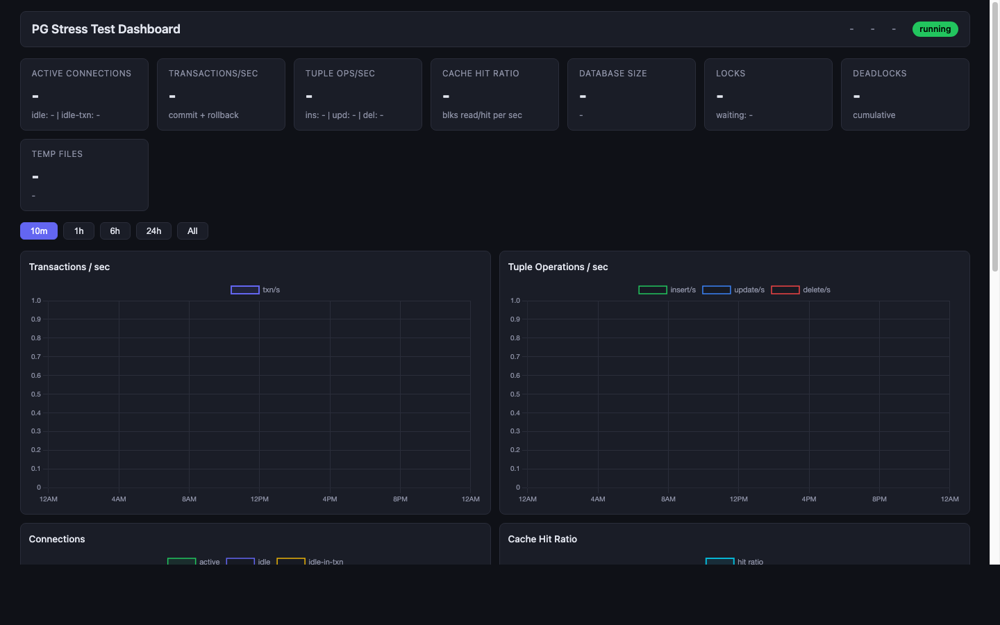

<!-- Logo placeholder -->
<p align="center">
  <strong>pg-stress</strong>
</p>

<p align="center">
  Dump production PostgreSQL &rarr; stress test with hypothetical scenarios &rarr; Claude-powered advisory. One-off, local-only.
</p>

<p align="center">
  <a href="LICENSE"></a>
  <a href="https://github.com/dataalgebra-engineering/pg-stress"></a>
  <a href="https://claude.ai"></a>
</p>

## Why pg-stress?

You have a production PostgreSQL database. You need answers:

- *"What happens if traffic grows 50%?"*
- *"Which queries break first at 3x load?"*
- *"What PostgreSQL knobs should we turn before Black Friday?"*
- *"Where are the hidden N+1 patterns the ORM is generating?"*

pg-stress answers these by running **one-off, local-only stress tests** against a copy
of your production data, then feeding the complete results to Claude for expert advisory.
No cloud, no Kubernetes -- dump your data onto a test server, run a scenario, get a report.

## What does it solve?

A local-first stress testing platform that produces **LLM-optimized PostgreSQL context**.
Dump production data onto a disposable test server, simulate hypothetical growth scenarios
(10% / 50% / 3x traffic), capture everything, and ask Claude for tuning advice,
query fixes, and capacity predictions.

## pg-stress vs pg-collector

| | pg-stress | pg-collector |
|---|---|---|
| **When** | One-off, before a change or event | Always running |
| **Where** | Test server (local, disposable) | Production |
| **Data** | Production dump + synthetic load | Live production queries |
| **Purpose** | "What if?" predictions | "What is?" observation |
| **Output** | LLM context bundle &rarr; advisory report | Metric time-series &rarr; dashboards |
| **Lifecycle** | Run, get report, tear down | Continuous telemetry |
| **Risk** | Zero (test server) | None (read-only observer) |

They're complementary -- pg-collector tells you what IS happening, pg-stress tells you what WILL happen.

## Three Use Cases

### 1. BYOD — Bring Your Own Data (most common)

Dump production, restore on test server, bring your own queries, stress test.

```bash
make import DUMP=/path/to/production.dump    # Restore + ANALYZE + baseline
make stress CLIENTS=50 DURATION=600          # Run your queries under load
make analyze                                 # Claude advisory report
```

### 2. WHAT IF — Inject Hypothetical Stress

On top of real production data, test growth scenarios:

```bash
make inject TABLE=orders ROWS=10000000       # "What if 10M more orders?"
make bulk-update TABLE=orders \
  SET="status='archived'" BATCH=100000       # "What if we archive 20M rows?"
make ladder STEPS="10,25,50,100,200"         # Find the connection breaking point
make analyze-tuning                          # Get PostgreSQL knob recommendations
```

### 3. SEED + STRESS — No Production Data

Pick a built-in workload profile, seed synthetic data, then stress:

```bash
make seed PROFILE=ecommerce                  # 18 tables, ~30M rows, ~10 GB
make stress CLIENTS=50 DURATION=600
make analyze
```

| Profile | Tables | Seed Size | Description |
|---------|--------|-----------|-------------|
| `ecommerce` | 18 | ~30M rows / 10 GB | Orders, products, carts, payments, reviews |
| `crm` | 12 | ~20M rows / 6 GB | Contacts, accounts, deals, activities |
| `saas-multi-tenant` | 15 | ~25M rows / 8 GB | Tenants, users, resources, audit |
| `iot-timeseries` | 6 | ~50M rows / 12 GB | Devices, readings, alerts |
| `content-platform` | 14 | ~35M rows / 9 GB | Users, posts, comments, feeds |

---

> ### Control Panel — configure intensity, inject rows, run growth ladders, trigger AI analysis
> 

---

> ### Metrics Dashboard — real-time TPS, cache ratio, connections, table sizes
> 

---

## How It Works

```
YOUR DATABASE                 TEST SERVER                    CLAUDE
─────────────                 ───────────                    ──────

pg_dump ────────────────────▶ 1. IMPORT
                                 pg_restore + ANALYZE
                                 Snapshot baseline

                              2. WHAT IF (optional)
                                 Inject rows, bulk update
                                 Open N connections
                                 Run growth ladder

                              3. STRESS
                                 Your queries + built-in generators
                                 Duration: 10-30 min

                              4. CAPTURE
                                 pg_stat_statements (full)
                                 Before/after deltas
                                 Anomalies flagged

                              5. ADVISE ────────────────▶  Tuning: ALTER SYSTEM commands
                                 Context bundle               Query fixes + indexes
                                 to Claude                    Capacity predictions
                                                              Breaking point analysis
```

## Quick Comparison

| | pg-stress | pgbench alone | k6 + SQL | Custom scripts |
|---|---|---|---|---|
| Bring your own data | Dump + restore + stress | Manual setup | Manual | Manual |
| WHAT IF scenarios | Row injection, connection ladder | No | No | Manual |
| AI advisory | Claude-powered, LLM-optimized output | No | No | No |
| ORM query patterns | N+1, eager load, EXISTS | No | Manual only | Manual only |
| Built-in workload profiles | 5 profiles (ecommerce, CRM, SaaS, IoT, content) | TPC-B only | Custom | Custom |
| Real-time dashboard | Built-in (Chart.js) | No | Grafana | No |
| Chaos injection | 6 patterns (deadlocks, flash sales, etc.) | No | Limited | Manual |
| Infrastructure | `docker compose up` | CLI | Docker + config | Varies |

## Profiles

pg-stress uses Docker Compose profiles to control which services run:

| Profile | Services | Ports | Use Case |
|---------|----------|-------|----------|
| *(none)* | postgres + raw-SQL + dashboard | 5434, 9090, 8000 | Core stress testing |
| `orm` | + ORM load generator | + 9091 | ORM fingerprint validation |
| `pgbench` | + pgbench runner | -- | Benchmark comparison |
| `collector` | + pg-collector + truth-service | + 8080, 8001 | Metric accuracy verification |
| `full` | Everything | All above | Complete validation suite |

## Quickstart

### Path A: I have production data (BYOD)

```console
$ git clone https://github.com/dataalgebra-engineering/pg-stress.git
$ cd pg-stress
$ make import DUMP=/path/to/production.dump   # Restore + ANALYZE + baseline snapshot
$ make stress CLIENTS=50 DURATION=600         # Stress test with 50 connections for 10 min
$ make analyze                                 # Claude advisory → out/analysis-*/
```

### Path B: I have production data + a hypothesis (WHAT IF)

```console
$ make import DUMP=/path/to/production.dump
$ make inject TABLE=orders ROWS=10000000       # "What if 10M more orders?"
$ make ladder STEPS="10,25,50,100,200"         # Find the connection breaking point
$ make analyze-tuning                          # Get knob recommendations
```

### Path C: I don't have production data (Seed + Stress)

```console
$ make up                                      # Seeds ecommerce profile (~30M rows)
$ make up-full                                 # All generators + dashboard + collector
$ make analyze                                 # Claude advisory
```

### After any path — AI analysis

```console
$ export ANTHROPIC_API_KEY=sk-ant-...
$ make analyze                                 # Full report
$ make analyze-tuning                          # PostgreSQL parameter tuning only
$ make analyze-queries                         # Query optimization + N+1 detection
$ make analyze-capacity                        # Growth projections + capacity limits
```

## WHAT IF Scenarios

The core differentiator. Inject hypothetical stress on top of real data:

| Command | What it tests |
|---------|---------------|
| `make inject TABLE=X ROWS=N` | "What if this table grows by N rows?" |
| `make bulk-update TABLE=X SET="..." BATCH=N` | "What if we update N rows?" |
| `make connections N=100 DURATION=300` | "What if we get 100 concurrent connections?" |
| `make ladder STEPS="10,25,50,100,200"` | "At what connection count does it break?" |

Growth ladder output (fed to Claude):

```
Phase   Conns  TPS    Cache    p99 Latency  Deadlocks  Temp Files
─────   ─────  ───    ─────    ───────────  ─────────  ──────────
1x      10     2340   0.998    45ms         0          0
2.5x    25     4200   0.994    67ms         0          0
5x      50     5100   0.971    189ms        2          0
10x     100    4800   0.923    487ms        14         847       ← BREAKING
20x     200    2100   0.841    2340ms       89         4200      ← DEGRADED
```

## Stress Intensity Profiles

For seed-based testing (Use Case 3), three intensity levels:

| | Gentle | Default | Heavy |
|---|---|---|---|
| **Burst connections** | 3 / 8 / 15 | 5 / 20 / 50 | 15 / 40 / 80 |
| **Chaos injection** | Disabled | 25% | 50% |
| **Pause between bursts** | 30-120s | 20-90s | 5-20s |
| **ORM concurrency** | 2 threads | 5 threads | 15 threads |

```console
$ SCENARIO=heavy make up-full
```

## Raw SQL Operations (Go + pgx)

25+ hand-written SQL operations across 6 categories with configurable traffic mix:

**Browse (default 50%)**
- Category listing with LEFT JOIN review aggregation, pagination (LIMIT/OFFSET)
- Product detail with variant + inventory JOINs and subquery avg rating
- Full-text search using pg_trgm similarity (`WHERE name % $1`)
- Session touch (UPDATE last_active)

**Cart (default 20%)**
- Add to cart with ON CONFLICT DO NOTHING
- Update cart quantity via correlated subquery
- Remove from cart via correlated subquery
- View cart with 4-way JOIN (cart_items, variants, products, inventory)

**Checkout (default 5% -- high contention)**
- Multi-statement transaction: SELECT ... FOR UPDATE (inventory lock) &rarr; validate quantity &rarr; UPDATE inventory &rarr; INSERT order &rarr; INSERT order_items &rarr; INSERT payment &rarr; COMMIT

**Order Management (default 10%)**
- Status transitions: pending &rarr; processing &rarr; shipped &rarr; delivered
- Payment settlement: captured &rarr; settled
- Shipment creation with EXISTS validation
- Tracking status updates with conditional delivered_at

**Background (default 10%)**
- Cart expiry: batch DELETE older than 24 hours (LIMIT 100)
- Session expiry: batch DELETE past expires_at (LIMIT 50)
- Search logging: INSERT with random query terms
- Audit logging: INSERT with JSONB metadata and random IP addresses
- Review writing: INSERT with random 1-5 rating

**Reporting (default 5%)**
- Hourly sales: date_trunc GROUP BY over 7-day window (168 buckets)
- Top products: 4-way JOIN with revenue aggregation (30-day window)
- Customer LTV: LEFT JOIN with full lifetime aggregation
- Low inventory: stock value report WHERE qty_available < 10

## Chaos Patterns

6 chaos patterns injected between bursts with configurable probability:

| Pattern | Behavior | What it stresses |
|---------|----------|------------------|
| **Abandoned checkout** | Hold FOR UPDATE lock 20-40s then ROLLBACK | Idle-in-transaction, lock waits |
| **Flash sale** | 20 concurrent transactions competing for same variant | Deadlocks, lock contention, serialization |
| **Bulk price update** | UPDATE 10K variants + INSERT 10K price_history in one transaction | Large batch writes, WAL pressure |
| **Cart cleanup storm** | DELETE 50K expired cart items | Mass deletion, vacuum pressure, dead tuples |
| **Inventory restock** | UPDATE 5K variants qty_available + 50-250 | Bulk updates, write amplification |
| **Index rebuild** | CREATE INDEX CONCURRENTLY &rarr; hold 5-10s &rarr; DROP INDEX CONCURRENTLY | Background maintenance, CPU/IO contention |

## ORM Query Patterns (SQLAlchemy 2.0)

10 distinct patterns producing different `pg_stat_statements` fingerprints than raw SQL:

| Pattern | Weight | What pg-collector sees |
|---------|--------|----------------------|
| **N+1 selects** | 15% | 1 `SELECT products` + N `SELECT product_variants WHERE product_id = $1` + N `SELECT inventory WHERE variant_id = $1` |
| **Eager joinedload** | 15% | Single `SELECT` with `LEFT OUTER JOIN` chains: customer &rarr; orders &rarr; items &rarr; variants |
| **Eager subqueryload** | 10% | `SELECT` base + `SELECT ... WHERE order_id IN (SELECT ...)` correlated subquery |
| **Eager selectinload** | 10% | `SELECT` base + `SELECT ... WHERE product_id IN ($1, $2, ..., $N)` -- variable IN-list sizes |
| **Bulk INSERT** | 5% | `INSERT INTO cart_items (...) VALUES (...) RETURNING id` (batched via `add_all + flush`) |
| **ORM update** | 10% | `SELECT ... WHERE id = $1` then `UPDATE ... SET ... WHERE id = $1` (load-modify-save) |
| **Pagination** | 10% | `SELECT ... ORDER BY ... LIMIT $1 OFFSET $2` with ORM-generated column lists |
| **Aggregation** | 10% | `func.count()`, `func.sum()`, `func.avg()`, `func.date_trunc()`, GROUP BY, HAVING |
| **EXISTS filter** | 10% | `WHERE EXISTS (SELECT 1 FROM reviews WHERE ...)` correlated subqueries via `.any()` |
| **Relationship filter** | 5% | ORM-generated JOINs via `.join(ProductVariant.inventory).join(ProductVariant.product)` |

**18 ORM Models** with full relationship mapping: Customer, Address, Category, Product, ProductVariant, Inventory, PriceHistory, Order, OrderItem, Payment, Shipment, Session, CartItem, Review, Promotion, CouponRedemption, SearchLog, AuditLog.

## pgbench Comparison

5 benchmark modes for baseline comparison:

| Mode | Description |
|------|-------------|
| `tpcb` | Standard TPC-B (SELECT + 3x UPDATE + INSERT per transaction) |
| `readonly` | Read-only TPC-B (SELECT only) |
| `mixed` | Alternates TPC-B and read-only phases |
| `custom` | Runs 3 custom e-commerce scripts: browse (category + product), checkout (transactional), reporting (aggregations) |
| `all` | Sequential execution of all modes with comparison report |

**Output per phase:** JSON results (TPS, latency avg/stddev, transactions), pg_stat_statements before/after snapshots (TSV), raw pgbench output, Markdown summary table.

## Dashboard

Real-time monitoring UI built with FastAPI + Chart.js:

**Live Charts**
- Transactions/sec (commits + rollbacks)
- Operations/sec (inserts, updates, deletes -- stacked)
- Connection breakdown (active, idle, idle-in-transaction)
- Cache hit ratio (0-1.0 range)
- Table row counts per append-only table
- Lock count and waiting locks

**Summary Cards** -- Active connections, TPS, ops/sec, cache hit ratio, database size, locks, deadlocks, temp files

**Table Monitor** -- Row counts vs. limits with color-coded bars (green &lt;70%, yellow 70-90%, red &gt;90%), dead tuple counts, safety event log

**Load Generator Panel** -- Live operation counters from `/healthz`, error count, burst count, uptime

**Controls** -- Time range filter (10m / 1h / 6h / 24h), auto-refresh every 10s

**Metrics Polled (every 10s):**
- `pg_stat_database`: xact_commit, xact_rollback, tup_inserted/updated/deleted/returned/fetched, blks_read, blks_hit, temp_files, temp_bytes, deadlocks
- `pg_stat_activity`: connection states (active, idle, idle_in_transaction)
- `pg_locks`: lock_count, lock_waiting (granted vs. waiting)
- `pg_stat_user_tables`: n_live_tup, n_dead_tup, pg_total_relation_size for all 18 tables
- Database size: `pg_database_size(current_database())`
- Computed rates: txn/s, insert/s, update/s, delete/s, blks_read/s, cache_hit_ratio

**Safety Monitor (every 30s):**
- Checks 5 append-only tables against configurable row limits
- Auto-prunes oldest rows (by `created_at`) when limit exceeded
- Batch deletes (50K per transaction) down to 70% of limit
- Warns if total database size exceeds max (default 20GB)
- Records SafetyEvent for each prune action

**API Endpoints:**
- `GET /health` -- Service health
- `GET /api/status` -- Elapsed time, scenario, latest sample, load generator status
- `GET /api/metrics?from=&to=` -- Time-range filtered metric samples
- `GET /api/tables` -- Row counts, dead tuples, sizes, safety events
- `GET /api/config` -- Active scenario and settings
- `POST /api/prune/{table}` -- Manual table prune trigger

## Truth Service

Verifies pg-collector metrics against PostgreSQL ground truth with configurable tolerances:

**Implemented Verifiers:**

| Panel | Status | Assertions |
|-------|--------|------------|
| **cache-memory** | PASS/FAIL | cache_hit_ratio (&plusmn;0.01 absolute), blks_hit (&plusmn;5%), blks_read (&plusmn;5%), database_size (&plusmn;10MB), numbackends (&plusmn;2) |
| **wal-checkpoints** | STUB | Planned: checkpoint timing, WAL bytes, buffer flushing |
| **locks** | STUB | Planned: lock counts, blocking PIDs from pg_locks |
| **replication** | STUB | Planned: write/flush/replay lag (requires replica) |

**Verification Method:** Takes two PostgreSQL snapshots with configurable delay (default 5s), computes ground-truth deltas (rates per second), reads latest collector JSONL sample (max age 120s), runs tolerance assertions, produces JSON + Markdown reports.

**Verdicts:** PASS, FAIL, WARN, SKIP

**API Endpoints:**
- `GET /verify/{panel}` -- Run verification, return VerificationResult JSON
- `GET /panels` -- List available panels with status
- `GET /health` -- Service health

## E-Commerce Schema

18 tables seeded with ~30M rows (~10 GB) covering a realistic e-commerce domain:

```
customers (1M) ─── addresses (2M)
    │
    ├── orders (5M) ─── order_items (15M) ─── product_variants (300K)
    │       │                                        │
    │       ├── payments (5M)                   inventory (300K)
    │       └── shipments (4M)                  price_history (700K)
    │
    ├── reviews (2M) ─── products (100K) ─── categories (500)
    │
    └── sessions (100K) ─── cart_items (dynamic)

promotions (1K) ─── coupon_redemptions (500K)
search_log (append-only)    audit_log (append-only)
```

**Key indexes:** unique constraints on email, slug, SKU, token, promo code; FK indexes on all foreign keys; partial index on low stock (`qty_available < 10`); trigram GIN index on product names (`gin_trgm_ops`); composite indexes for common query patterns.

## AI Analyzer (Claude-Powered)

After running a stress test, the analyzer collects 10 diagnostic datasets from PostgreSQL
and sends them to Claude for expert-level analysis and recommendations:

**Data Collected:**
- Top 50 queries by total execution time (with cache ratios, temp usage, latency stats)
- Queries with worst cache hit ratios (< 0.95)
- Queries spilling to temp files
- N+1 candidates (high-call-count simple SELECTs with low rows/call)
- Database-level stats (TPS, cache ratio, deadlocks, temp files)
- Table stats (live/dead rows, seq vs idx scan ratios, vacuum state)
- Index stats + unused index detection
- Connection state breakdown
- Lock state and wait events
- Current PostgreSQL configuration (30+ tuning-relevant settings)

**Analysis Modes:**

| Command | Focus | What you get |
|---------|-------|--------------|
| `make analyze` | Full | Health score, top findings, all recommendations |
| `make analyze-tuning` | PG knobs | Parameter-by-parameter tuning with ALTER SYSTEM commands |
| `make analyze-queries` | Queries | N+1 detection, ORM vs raw SQL attribution, index suggestions |
| `make analyze-capacity` | Capacity | Growth projections, resource headroom, scaling recommendations |
| `make analyze-collect` | Data only | Raw diagnostic JSON (no AI, no API key needed) |

**Example output from `make analyze-tuning`:**

```
┌─────────────────────┬─────────┬─────────────┬─────────────────────────────┐
│ Parameter           │ Current │ Recommended │ Rationale                   │
├─────────────────────┼─────────┼─────────────┼─────────────────────────────┤
│ work_mem            │ 16MB    │ 64MB        │ 847 temp files from         │
│                     │         │             │ reporting aggregation query  │
│ shared_buffers      │ 256MB   │ 512MB       │ Cache hit ratio 0.94 on     │
│                     │         │             │ order_items table scans      │
│ effective_cache_size│ 1GB     │ 2GB         │ Planner underestimates      │
│                     │         │             │ index-only scan viability    │
└─────────────────────┴─────────┴─────────────┴─────────────────────────────┘
```

Reports saved to `out/analysis-YYYYMMDD-HHMMSS/` with both raw data (JSON) and analysis (Markdown).

## PostgreSQL Configuration

Production-tuned for OLTP stress testing with full observability:

| Category | Setting | Value |
|----------|---------|-------|
| **Memory** | shared_buffers | 256MB |
| | effective_cache_size | 1GB |
| | work_mem | 16MB |
| | maintenance_work_mem | 128MB |
| **WAL** | wal_buffers | 16MB |
| | max_wal_size | 2GB |
| | checkpoint_completion_target | 0.9 |
| **Planner** | random_page_cost | 1.1 (SSD) |
| | effective_io_concurrency | 200 |
| | default_statistics_target | 200 |
| **Monitoring** | pg_stat_statements.track | all |
| | pg_stat_statements.max | 10,000 |
| | track_activities / counts / io_timing / wal_io_timing / functions | all on |
| **Logging** | log_min_duration_statement | 1000ms |
| | log_checkpoints / lock_waits / autovacuum | on |
| **Autovacuum** | max_workers | 4 |
| | naptime | 30s |
| | vacuum_scale_factor | 0.05 |

## Deployment Layout

```
pg-stress/
├── .github/workflows/
│   ├── ci.yml                   # Build, lint, test, smoke test
│   └── release.yml              # Tag-based GitHub releases
│
├── docker-compose.yml           # Unified stack with profiles
├── docker-compose.truth.yml     # Standalone truth infrastructure
├── Makefile                     # 25+ targets
├── .env.example                 # 50+ configurable variables
│
├── load-generator/              # Go 1.23 + pgx/v5
│   ├── main.go                  # 25+ SQL operations, 6 chaos patterns, burst scheduler
│   ├── schema.sql               # 18-table schema + 30M row seed
│   └── Dockerfile
│
├── load-generator-orm/          # Python 3.12 + SQLAlchemy 2.0
│   ├── main.py                  # 10 ORM pattern workers, threaded executor
│   ├── models.py                # 18 ORM models with full relationships
│   └── Dockerfile
│
├── pgbench-runner/              # PostgreSQL 15 Alpine
│   ├── entrypoint.sh            # 5 benchmark modes, JSON output
│   ├── scripts/                 # 3 custom e-commerce SQL scripts
│   └── Dockerfile
│
├── dashboard/                   # Python 3.12 + FastAPI + asyncpg
│   ├── app/                     # Poller, safety monitor, metrics store, REST API
│   ├── static/                  # Chart.js dashboard (6 charts, summary cards)
│   └── Dockerfile
│
├── truth-service/               # Python 3.12 + FastAPI + asyncpg
│   ├── app/verifiers/           # 4 verifier panels (1 implemented, 3 stubs)
│   ├── app/                     # JSONL reader, PG client, report generator
│   └── Dockerfile
│
├── analyzer/                    # Claude-powered AI analysis
│   ├── collect.py               # PostgreSQL diagnostic data collector
│   ├── analyze.py               # Claude API integration + report generation
│   └── Dockerfile
│
├── scenarios/                   # 3 load profiles (gentle / default / heavy)
├── configs/postgres/            # postgresql.conf + pg_hba.conf
├── configs/collector/           # pg-collector JSONL config
├── scripts/                     # deploy-remote.sh, run-benchmark.sh, collect-report.sh
├── docs/                        # pgbench comparison strategy
└── out/                         # Reports and benchmark results (gitignored)
```

## Commands

| Command | What it does |
|---------|-------------|
| `make up` | Start core stack (postgres + raw-SQL + dashboard) |
| `make up-orm` | Core + ORM load generator |
| `make up-bench` | Core + pgbench comparison runner |
| `make up-collector` | Core + pg-collector + truth-service |
| `make up-full` | Start everything |
| `make down` | Stop all services, remove volumes |
| `make stop` | Stop all services, keep volumes |
| `make restart` | Restart core stack |
| `make status` | Show running containers |
| `make logs` | Follow all service logs |
| `make logs-loadgen` | Follow raw SQL generator logs |
| `make logs-orm` | Follow ORM generator logs |
| `make logs-bench` | Follow pgbench runner logs |
| `make logs-collector` | Follow collector + truth-service logs |
| `make psql` | Interactive PostgreSQL shell |
| `make seed` | Re-seed database schema and data |
| `make pg-stat` | Top 20 queries by execution time |
| `make pg-stat-reset` | Reset pg_stat_statements counters |
| `make db-size` | Show database and table sizes |
| `make bench` | Run pgbench benchmark locally |
| `make bench-remote` | Run pgbench on remote server |
| `make verify` | Run all truth-service verifications |
| `make healthz` | Check health of all services |
| `make report` | Collect comprehensive report locally |
| `make report-remote` | Collect report from remote server |
| `make analyze` | AI analysis of running stack (full report) |
| `make analyze-tuning` | AI analysis focused on PG parameter tuning |
| `make analyze-queries` | AI analysis focused on query optimization |
| `make analyze-capacity` | AI analysis focused on capacity predictions |
| `make analyze-collect` | Collect diagnostic data only (no AI) |
| `make deploy` | Deploy to remote server (default: ssh 4) |
| `make deploy-full` | Deploy full stack to remote |
| `make clean` | Stop everything, remove volumes and output |
| `make clean-images` | Clean + remove all built Docker images |
| `make help` | Show all available targets |

## Features

**Raw SQL Load Generator (Go)**
- [x] 25+ hand-written e-commerce SQL operations across 6 categories
- [x] Configurable traffic mix weights (browse/cart/checkout/order/background/reporting)
- [x] Burst-based load scheduler with 3 intensity levels and weighted selection
- [x] Connection pool management via pgx/v5 (configurable max pool size)
- [x] Atomic lock-free counters for real-time stats tracking
- [x] JSON healthz endpoint on port 9090 with operation counts, errors, config
- [x] Graceful shutdown on SIGINT/SIGTERM with context cancellation
- [x] Wait-for-data startup gate (blocks until seed data is present)
- [x] Configurable stats reporting interval

**Chaos Injection Engine**
- [x] Abandoned checkout: hold FOR UPDATE lock 20-40s then ROLLBACK (idle-in-transaction)
- [x] Flash sale: 20 concurrent buyers competing for same variant with row-level locks
- [x] Bulk price update: 10K variant price changes in single transaction
- [x] Cart cleanup storm: DELETE 50K expired cart items (vacuum pressure)
- [x] Inventory restock: UPDATE 5K variants with random qty adjustments
- [x] Index rebuild: CREATE INDEX CONCURRENTLY &rarr; hold &rarr; DROP INDEX CONCURRENTLY
- [x] Configurable chaos probability (0-100%) and per-burst injection timing

**ORM Load Generator (SQLAlchemy)**
- [x] 10 distinct ORM query patterns with configurable mix weights
- [x] N+1 lazy loading: products &rarr; variants &rarr; inventory (1 + N + N queries)
- [x] Eager joinedload: single SELECT with LEFT OUTER JOIN chains
- [x] Eager subqueryload: correlated IN (SELECT ...) subqueries
- [x] Eager selectinload: variable-length IN ($1, $2, ..., $N) lists
- [x] Bulk INSERT via add_all() + flush() with RETURNING id
- [x] ORM load-modify-save: SELECT by PK &rarr; mutate &rarr; UPDATE on flush
- [x] Paginated queries: LIMIT/OFFSET with ORM column introspection
- [x] Aggregation: func.count/sum/avg/date_trunc with GROUP BY and HAVING
- [x] EXISTS subqueries via .any() / .has() relationship methods
- [x] Relationship-based JOIN chains via .join(Relationship) API
- [x] 18 fully mapped ORM models with bidirectional relationships
- [x] Threaded worker pool with configurable concurrency
- [x] JSON healthz endpoint on port 9091

**pgbench Comparison Runner**
- [x] 5 benchmark modes: tpcb, readonly, mixed, custom, all
- [x] Automatic pgbench table initialization with configurable scale factor
- [x] Warmup phase before measurement (configurable duration)
- [x] 3 custom e-commerce SQL scripts (browse, checkout, reporting)
- [x] pg_stat_statements snapshots before and after each phase
- [x] Structured JSON output per phase (TPS, latency, transactions)
- [x] Comparison report across all phases
- [x] Keep-alive mode for result retrieval from Docker volumes

**Real-Time Dashboard**
- [x] 6 live Chart.js charts (TPS, ops/s, connections, cache ratio, table rows, locks)
- [x] Summary cards with key metrics (connections, TPS, cache ratio, DB size, deadlocks)
- [x] Table monitoring panel with row counts vs. limits (color-coded progress bars)
- [x] Load generator status panel from healthz endpoints
- [x] Time range filter (10m / 1h / 6h / 24h)
- [x] Auto-refresh every 10 seconds
- [x] Ring buffer metrics store (24h retention at 10s intervals)
- [x] REST API with time-range filtered metric queries

**Safety Monitor**
- [x] Automatic pruning of 5 append-only tables at configurable row limits
- [x] Batch deletion (50K rows per transaction) targeting oldest rows by created_at
- [x] Configurable prune target (default 70% of limit)
- [x] Database size monitoring with configurable max (default 20GB)
- [x] Safety event logging with timestamp, action, table, rows_before/after
- [x] Manual prune trigger via REST API

**Truth Service (Metric Verification)**
- [x] Two-snapshot ground truth methodology with configurable delay
- [x] Tolerance framework: absolute (ratios, sizes), relative % (counters, gauges)
- [x] cache-memory verifier: cache_hit_ratio, blks_hit, blks_read, database_size, numbackends
- [x] Collector JSONL reader with PascalCase field mapping and age filtering
- [x] JSON + Markdown report generation per verification run
- [x] Pluggable verifier registry (add panels by subclassing BaseVerifier)
- [x] Dual-mode operation: FastAPI server or CLI with exit code

**E-Commerce Database**
- [x] 18-table schema covering customers, products, orders, payments, shipments, sessions, reviews
- [x] ~30M rows seeded via pure SQL (no external files): 1M customers, 5M orders, 15M order_items
- [x] Hierarchical categories (25 top-level x 20 subcategories)
- [x] Full-text search index via pg_trgm GIN
- [x] Partial index on low stock inventory (qty_available < 10)
- [x] Append-only operational tables (search_log, audit_log)
- [x] JSONB metadata column on audit_log

**PostgreSQL Tuning**
- [x] Production-tuned postgresql.conf (memory, WAL, planner, autovacuum)
- [x] pg_stat_statements: track=all, max=10K queries
- [x] Full monitoring: track_activities, track_counts, track_io_timing, track_wal_io_timing, track_functions=all
- [x] Aggressive autovacuum (4 workers, 30s naptime, 0.05 scale factor)
- [x] SSD-optimized planner (random_page_cost=1.1, effective_io_concurrency=200)
- [x] Slow query logging (threshold 1000ms)
- [x] Checkpoint, lock wait, and autovacuum logging enabled

**Operations & Deployment**
- [x] Docker Compose profiles (core, orm, pgbench, collector, full)
- [x] 3 scenario profiles with 50+ configurable parameters each
- [x] .env.example with 50+ documented environment variables
- [x] One-command SSH deployment to remote servers
- [x] Comprehensive report collection (pg_stat_statements, table sizes, connections, locks)
- [x] Resource limits on all containers (memory caps)
- [x] JSON-file logging with rotation (max 25-50MB x 3 files per service)
- [x] Health checks on all services

**AI Analyzer (Claude-Powered)**
- [x] Collects 10 diagnostic datasets from PostgreSQL (top queries, cache misses, temp spills, N+1 candidates, table/index stats, locks, wait events, PG config)
- [x] Full analysis mode: health score, top findings, query optimization, PG tuning, capacity predictions
- [x] Tuning focus: parameter-by-parameter recommendations with ALTER SYSTEM commands
- [x] Query focus: N+1 detection, ORM vs raw SQL attribution, missing index suggestions with CREATE INDEX statements
- [x] Capacity focus: growth projections per table, resource headroom, scaling thresholds
- [x] Collect-only mode (no API key required) for raw diagnostic JSON export
- [x] Reports saved as Markdown + JSON to out/ directory
- [x] Powered by Anthropic Claude API (configurable model)

**CI/CD**
- [x] GitHub Actions CI: build all 5 Docker images, lint Go (vet + build), lint Python (ruff), test truth-service, validate compose files, shellcheck scripts
- [x] Integration smoke test: start core stack, verify seeding, check healthz endpoints, validate pg_stat_statements
- [x] Tag-based release workflow with auto-generated release notes
- [x] Build cache via GitHub Actions cache (docker buildx gha)

## Documentation

| Doc | Description |
|-----|-------------|
| [How It Works](docs/01-how-it-works.md) | Five-phase workflow, pg-stress vs pg-collector, context bundle format |
| [Scenarios](docs/02-scenarios.md) | Traffic multipliers, row injection, schema change simulation |
| [AI Analyzer](docs/03-ai-analyzer.md) | Claude integration, analysis modes, what gets collected |
| [Configuration](docs/04-configuration.md) | All environment variables by service |
| [Schema](docs/05-schema.md) | 18-table e-commerce schema, indexes, append-only table limits |
| [Control Plane](docs/06-control-plane.md) | 9 knobs: inject, bulk-update, connections, ladder, analyze, generators |

## Relationship to Burnside Project

| Project | Role |
|---------|------|
| [pg-collector](https://github.com/burnside-project/pg-collector) | Ongoing production telemetry ("what IS happening") |
| [pg-warehouse](https://github.com/burnside-project/pg-warehouse) | Local-first analytical warehouse (PostgreSQL &rarr; DuckDB) |
| **pg-stress** | One-off stress test &rarr; LLM advisory ("what WILL happen") |

## Community

- [GitHub Issues](https://github.com/dataalgebra-engineering/pg-stress/issues) -- Bugs and feature requests
- [GitHub Discussions](https://github.com/dataalgebra-engineering/pg-stress/discussions) -- Questions and ideas

## License

[Apache License 2.0](LICENSE) -- Copyright 2025-2026 [Burnside Project](https://burnsideproject.ai)
